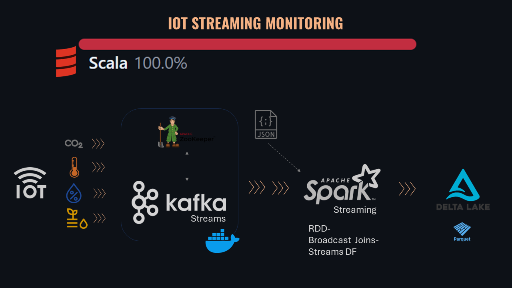

# Spark Structured Streaming with Kafka and Scala




## StreamSmart Farm IoT Monitoring Project

This project involves real-time monitoring of a smart farm using Spark Structured Streaming, Kafka, and Scala.
The application processes data from sensors measuring CO2 levels, temperature, humidity, and soil moisture, which are sent to Kafka topics and consumed by Spark for real-time analytics.

The project has been refactored from a monolithic object-oriented structure into a modular and maintainable codebase adhering to Clean Code, SOLID principles, and Scala best practices,
as part of the [EOI Data Engineering Master Degree](https://www.eoi.es/es/cursos/89564/master-en-ingenieria-de-datos-online) program.

## Features
- **Real-time Data Processing:** Using Spark Structured Streaming to process and analyze sensor data in real-time.
- **Kafka Integration:** Consuming sensor data from Kafka topics.
- **Delta Lake:** Storing processed data using Delta Lake for ACID transactions and scalable metadata handling.
- **Zone Enrichment:** Enhancing sensor data by joining with static zone data from a JSON file.
- **Custom Streaming Query Listener:** Implementing a custom listener to monitor the progress and status of streaming queries.
- **Watermark and Windowing:** Handling late data and computing windowed aggregations.
- **Error Monitoring:** Tracking and logging defective sensor data using accumulators.

## Branches
1. **develop:** Contains the refactored code with the following key implementations:
- Watermarks and Windows: Managing late data and computing average sensor readings in defined intervals.
- Zone Assignment: Enriching sensor data by joining with zone data.
2. **week4:** Implements specific exercises including data enrichment, handling duplicates, and managing late arrivals.

## Implementation Details
### Key Concepts
- **Watermark and Window:** Used to handle late arriving data and compute aggregations over time windows.
- **Kafka:** Acts as the data ingestion layer, where sensor data is published to different topics.
- **Delta Lake:** Used for storing enriched sensor data and managing schema evolution.
- **Broadcast Join:** Optimized join between streaming sensor data and static zone data for better performance.
- **Accumulators:** Tracking errors in sensor data for monitoring and debugging purposes.
- **Checkpoints:** Critical for ensuring fault tolerance and exactly-once processing semantics in Spark Streaming applications.
Checkpoints are used to store intermediate states and offsets to handle failures gracefully.
## Modules
- **config:** Configuration files for Kafka and Spark.
- **io:** Data generators for simulating sensor data and sending it to Kafka.
- **models:** Case classes representing different types of sensor data.
- **processing:** Classes for processing different types of sensor data streams.
- **projectutil:** Utility classes including the custom streaming query listener and zone data loader.
- **schemas:** Schema definitions for sensor data and zone data.
- **services:** Core services for managing data storage, processing, and monitoring.

## Refactoring Highlights
  The project has been refactored to follow Clean Code and SOLID principles.
  **Key improvements include:**
- Breaking down the monolithic object into smaller, single-responsibility classes and objects.
- Encapsulating Kafka and Spark configurations in separate modules.
- Implementing reusable processing components for different sensor types.
- Using dependency injection for better testability and maintainability.

## Exercises Implemented
### Week 4
- **Enrich Sensor Data with Zone Information:** Joining sensor data with zone data to enhance the dataset.
- **Handle Duplicates and Late Data:** Modifying Kafka data generator to simulate duplicate and late arriving data.
**Analytics by Zone:**
- **Watermark and Window:** Compute average temperature per sensor in 10-minute intervals, allowing late data up to 5 minutes.
- **Broadcast Join:** Efficiently join sensor data with static zone data.
- **Accumulators:** Count errors in sensor data.

## Final Delivery Exercises
1. **Watermark and Window:** Handle late data and compute windowed aggregations.
2. **CUBE, GROUPING SET, ROLLUP:** Perform complex aggregations for sensor data.
3. **Broadcast Join:** Optimize joins between streaming and static data.
4. **Accumulators:** Track error counts in sensor data.
5. **State Operations:** Implement stateful transformations.
6. **Prometheus Metrics:** Add application monitoring with Prometheus (Optional).

## Setup and Usage
1. **Clone the Repository:**
```sh
git clone https://github.com/Rafavermar/Scala-Spark-Kafka-Iot-Monitoring.git
cd Scala-Spark-Kafka-Iot-Monitoring
```
2. **Build the Project:**
```` sh
sbt clean compile
````
3. **Start Kafka and Zookeeper:**
```sh
docker compose up -d
```
4**Run the Data Generator:**
```sh
sbt "runMain io.KafkaDataGeneratorMain"
```` 
5**Start the Spark Application:**
```sh
sbt "runMain Main2"
```

## Environment Setup
To ensure your Scala and Spark projects run smoothly in IntelliJ IDEA, especially with Java 17, follow these detailed setup instructions:

### Prerequisites
1. **Scala Plugin**: Ensure the Scala plugin is installed and enabled in IntelliJ IDEA.
2. **Java SDK**: Java 17 should be installed. Set up the SDK in IntelliJ to use Java 17.
3. **sbt**: Install sbt, preferably version 1.10, which supports a range of Scala and Spark functionalities.
4. **Scala**: Configure your project to use Scala version 2.13.14.

### Versions Used
   - **Spark: 3.5.1**
   - **Delta Lake: 3.2.0**
   - **Scala: 2.13.14**
   - **Typesafe Config: 1.4.3**
   - **Java: 17**
   - **Kafka: 7.2.1**
   - **Zookeeper: 7.2.1**

### IntelliJ IDEA Configuration
1. **Project Settings**:
    - Go to `File > Project Structure`.
    - In `Project Settings > Project`, select the Java 17 SDK.
    - In `Project Settings > Modules`, ensure your module is set to Scala 2.13.14.

2. **Execution Configuration**:
    - Open run and debug configurations: `Run > Edit Configurations`.
    - Add or edit your Scala/Spark application configuration.
    - In the `VM options` section, add the following lines to ensure compatibility of Spark with Java 17:
      ```
      --add-opens java.base/java.lang=ALL-UNNAMED
      --add-opens java.base/java.util=ALL-UNNAMED
      --add-opens java.base/java.io=ALL-UNNAMED
      --add-opens java.base/java.util.concurrent=ALL-UNNAMED
      --add-opens java.base/java.util.concurrent.atomic=ALL-UNNAMED
      --add-opens java.base/java.util.concurrent.locks=ALL-UNNAMED
      --add-opens java.base/java.util.regex=ALL-UNNAMED
      --add-opens java.base/java.util.stream=ALL-UNNAMED
      --add-opens java.base/java.util.function=ALL-UNNAMED
      --add-opens java.base/java.util.jar=ALL-UNNAMED
      --add-opens java.base/java.util.zip=ALL-UNNAMED
      --add-opens java.base/java.util.spi=ALL-UNNAMED
      --add-opens java.base/java.lang.invoke=ALL-UNNAMED
      --add-opens java.base/java.lang.reflect=ALL-UNNAMED
      --add-opens java.base/java.net=ALL-UNNAMED
      --add-opens java.base/java.nio=ALL-UNNAMED
      --add-opens java.base/sun.nio.ch=ALL-UNNAMED
      --add-opens java.base/sun.nio.cs=ALL-UNNAMED
      --add-opens java.base/sun.security.action=ALL-UNNAMED
      --add-opens java.base/sun.util.calendar=ALL-UNNAMED
      --add-opens java.security.jgss/sun.security.krb5=ALL-UNNAMED
      ```
    - Ensure the option "Add dependencies with 'provided' scope to classpath" is checked.

## Disclaimer
This project has been an opportunity for me to learn and apply concepts related to Spark Structured Streaming, Kafka, and Scala in a real-world scenario. The code may contain conceptual errors and bugs, as I am still in the learning process. The project has not been intensively supervised but rather has been a chance to tackle the challenges autonomously. My professor provided guidance and indications, with the objective of learning through doing, facing, and overcoming errors.

## Acknowledgements
I would like to extend my heartfelt gratitude to Professor [Mario Renau Arce](https://www.eoi.es/es/cursos/89564/master-en-ingenieria-de-datos-online) for his fantastic contribution to my learning journey. His extensive material, exceptional explanations, and insistence on pushing us out of our comfort zones to wrestle with the code have been invaluable. I hold him in high regard for his dedication and support. 

Likewise to **my classmates**, for their support and camaraderie throughout the course. I am grateful for the opportunity to learn from them and share this experience.

And of course thanks to the school **EOI** for providing me with the opportunity to learn and grow in the field of Data Engineering.